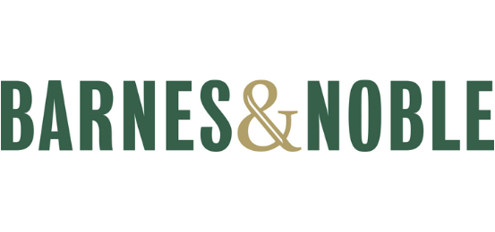

Within the world of the book lover, perhaps the most comforting and reassuring place to be is in the bookshop. Whether you are settling down to do some work at the coffee shop within, or simply browsing the shelves to wait out a rainstorm, there's nothing quite like being surrounded by books.

But what is it that makes a bookshop seem like *the* *place* to be? Contrary to what our hearts like to believe, this haven to the bookish soul is a business and the centre of the brand is displayed to the public via aesthetics and aesthetics alone.

The two giants of the Book Industry bookshop-wise lie across the Atlantic from one another. These are of course; **Barnes & Noble** and **Waterstones**. While both hold their own in their own right, they approach very different marketing strategies. The most obvious element of their branding would of course be the typography they choose to use.

### Barnes & Noble

The American super-store encompasses the American look with the words '**Barnes**' and '**Noble**' bodly stamped out in ***Bureau Grot Comp Medium*** filling the eyes of the reader, claiming its space just as the company's buildings themselves impose upon their customers. This is a standard looking font similar to other popular ones like Bebas Neue and Oswald. With minimal tracking between characters and completely capitalised letters, Bureau Grot Comp Medium is easy to read and impossible to miss.

Originally, the word 'Booksellers' took up its place, within the logo, beneath the company name. It was set in a more traditional serif font called ***Mrs Eaves Bold*** which perhaps mimicked the usual fonts found in the text of most novels. However, within recent years the chain decided to drop the additional text and simplify the logo to keep up with the times, adopting a more minimal look. 

Now, what some might say is the only characterful piece in the brand's typography is the ampersand found between the two company names. The uniform, blocks of green are broken up by a golden, sometimes orange, symbol simultaneously destroying the harmony *and* joining the **Barnes** brothers with their co-founder G. Clifford **Noble**.

Despite having launched well over 100 years ago, Barnes & Noble remains one of the giants in the book industry with over 600 retails stores and near-worldwide recognition.

### Waterstones

Like Barnes & Noble, Waterstones is named after its founder Tim Waterstone however, unlike its US equivilant, it was only founded 38 years ago and is represented by far fewer stores. Another difference that the two companies share is the contrast to one another in terms of typography.

The word '**Waterstones**' stands alone, unobtrusive but still quietly present. The font the word is displayed in is one of the most recognisable fonts across the globe: **Baskerville**. Baskerville is a serif typeface that was designed in the 1750s by a Mr John Baskerville. It is elegant but remains easy to read. Unlike earlier serif fonts, there is a larger distinction between the strokes used. This makes it very popular in book design which is most likely the reason why Waterstones adopted it as their own.

Despite the popularity of the typeface, the Waterstones logo is instantly identifiable. The association with the written word allows what could be a rather dull font to easily be a characterful, strong logo for the brand.