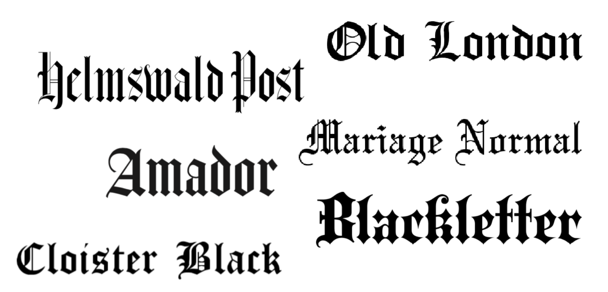
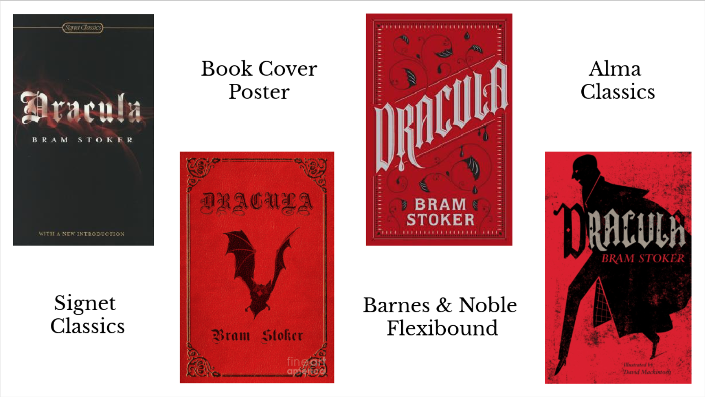

Out of all of the elements of the term *gothic* - think haunted mansions, candlelight and howling winds - great works of literature come to mind. Perhaps the most infamous examples of these is the literary masterpiece that is Dracula by Bram Stoker. There have been many different editions of Dracula since its publication date in 1897 but when it comes to the cover-designer's choice of typography one style reigns triumphant. The iconic and most widely seen of all being any variation of **Old English**.

**Old English** was commonly used throughout England, France, Germany, Italy and the Netherlands between the 12th and 17th centuries. With a medieval influence, the typeface is characterised by its use of heavy and dramatic strokes with a particular flourish on capital letters. 

Interestingly, Dracula wasn't published until the 19th century however Bram does describe the Transylvanian landscape in dramatic settings with the ancient and monstrous character of Dracula having existed in the gloom invoking a past, forgotten time. Dracula is thought to be inspired by the 15th century Wallachian Prince Vlad the Impaler putting the character right in the middle of the typeface's popularity point. He is also described to be 'centuries-old' which would also most likely put him in the right place for use of the **Old English** typeface.

A genre that was particularly popular during the Victorian era was Gothic literature. It allowed authors to step back in time and create something that was truly atmospheric and captured a different time and place. The caligraphy-like element to Old English typeface allows for 

Along with the typeface red is used to represent the vampiric main character and his taste for blood, and the black that it is paired with lends to the gothic element and hints at sinister things to come.