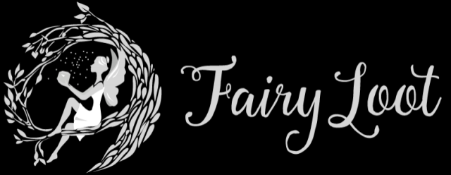
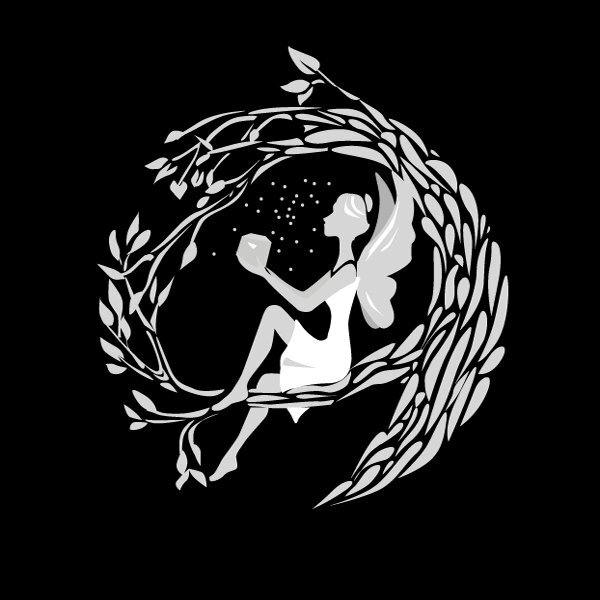
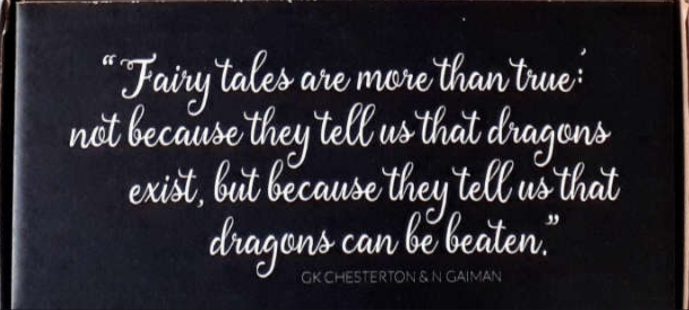

Twelve times a year subscription box company FairyLoot sends 6-7 bookish goodies out to their customers along with a signed, hardcover new release to add to their bookshelves.

The brand has gained popularity after gifting their boxes to various Instagrammers, Bloggers and YouTubers to feature in their posts via unboxings or photographs displaying items. 

FairyLoot clearly reveals themselves as a subscription box based around books within the Fantasy genre. A fairy is seen sitting in a wreath made of branches or twigs, holding a jar as she releases fireflies. Next to her lies the Fairy Loot typographic logo.

The typeface that the logo is written in again lends itself to the fantasy genre with a typeface that is handwritten in-style with twining, flourishing serifs. The serif on the 'F' looks like a vine extending from the letter itself. 

Interestingly, there is no reference to books within the logo or even symbolically within the text. The box relies purely on the fantasy element to attract subscribers. As the box is for young adults, perhaps the fairy hints at the box being a youthful one.

Text on side of box

