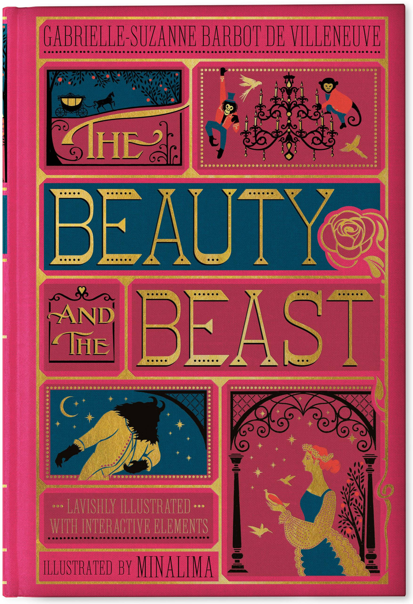
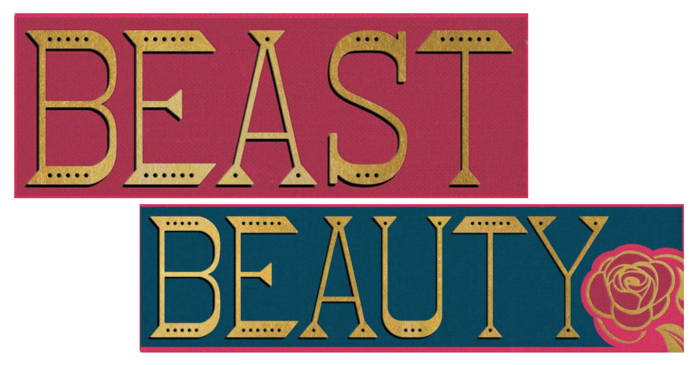
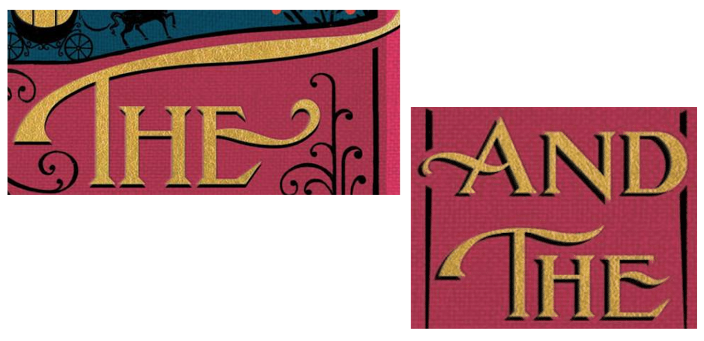
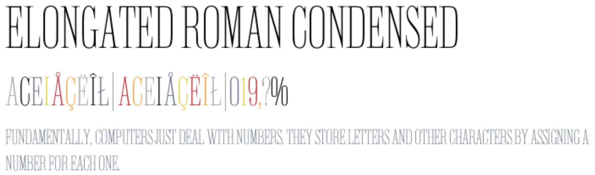

In 2008, design studio MinaLima produced editions of classic children's stories quite unlike any before. These copies maintained the simple beauty of the pop-up book while encasing it in a cover that looked deluxe and gift-worthy. Their covers harp back to a time when novels were bound in leather and imprinted with gold lettering but bright colours and unique illustrations bring a modern twist to these beautiful collector's pieces. 

As of November 2020 there are currently six books in the MinaLima classics editions. For the sake of looking at the covers a little more closely so as to analyse the fonts, I will be using *The Beauty and the Beast* as an example.

Both the typeface used for '*Beauty*' and '*Beast*' and the font used for '*the*' and '*and* *the*' were specifically created by the design company for these books.

The typography choice for 'Beauty' and 'Beast' is reminiscent of traditional fairytale books produced for the first-ever editions of the actual tale itself. It is a novelty font, entirely capitalised, with angular serifs and cutouts along the base and height of each individual letter. 

The article words 'the' and 'and' are very different stylistically from the other examples of typography found on this book cover. The exaggerated ligature-like extensions on some of the letters 

The authors' names and the description of the novel are written in **Elongated Roman**, a tall, capitalised serif font where all the letters are the same height. This uniformed font is easy to read while still adding a unique flair to tie in with the rest of the elements on the book cover.

Most of the typography is printed in gold foil which adds to the deluxe image the designer wants to present and allows the company to price the books at what some might see as a steep price at £25 RRP.