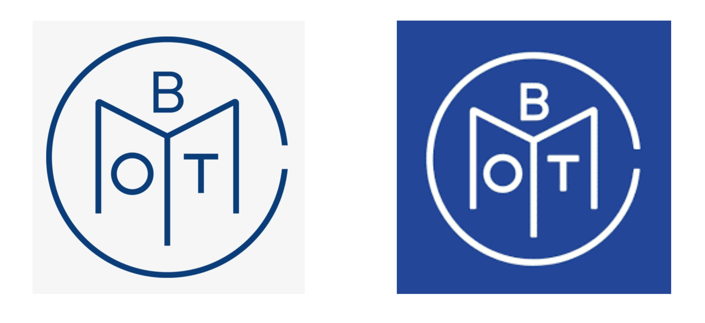

Since 1926, Book of the Month has been one of the most successful and unique subscription services out there. Each month subscribers are allowed to pick one hardcover book from a selection of five to receive for the inexpensive fee of $14.99 per month. Unlike other book subscription boxes, Book of the Month allows their subscribers to skip a month with no charge if none of the ones selected that month interests them.

The company logo is made up of the letters in the company name. 

The box containing the subscriber's book of that month comes with the company name printed on the side of it. The name is written in a font that is a variation of Garamond Standard Book Narrow Italic. 

The box itself is a navy blue colour so the text is displayed in white so as to be easily readable. Whenever the font is displayed against a white background i.e. on their website, it is in that same blue colour.