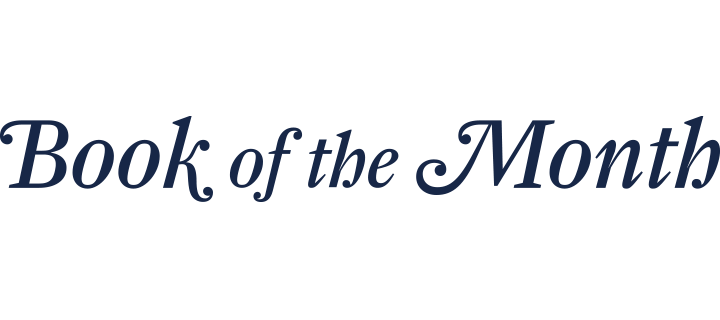

Since 1926, Book of the Month has been one of the most successful and unique subscription services out there. Each month customers are allowed to pick one hardcover book from a selection of five to receive for the inexpensive fee of $14.99 per month. Unlike other book subscription boxes, Book of the Month allows their subscribers to skip a month with no charge if none of the books selected that month interests them.

The company logo is made up of the letters in the company name. The 'M' for 'Month' creates a book-like silhouette for the 'B', 'O' and 'T' to nestle around. 

The box containing the subscriber's book of that month comes with the company name printed on the side of it. The name is written in a font that is a variation of Garamond Standard Book Narrow Italic. The serifs on the font are played with to create a look for the brand which is unique to them. The words 'of the' are displayed in a slightly smaller fon than 'Book' and 'Month' which in turn highlights these words and instantly lets potential subscribers see that a 'Book' will be provided every 'Month'.

The box itself is a navy blue colour so the text is displayed in white so as to be easily readable. Whenever the font is displayed against a white background i.e. on their website, it is in that same blue colour.