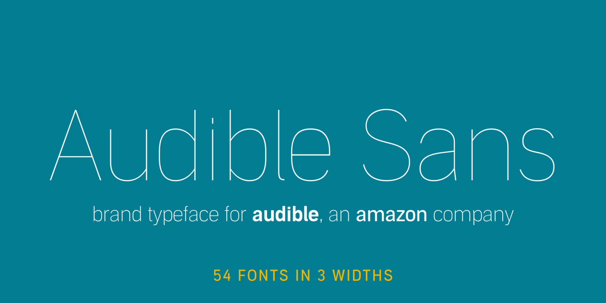
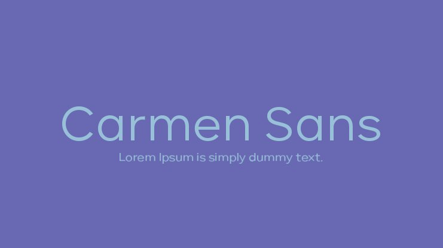

Audiobooks have been available to the public since the 1970s when libraries started stocking cassette tapes of popular books but it wasn't until the 1990s that audio really took off as audio became more portable.

Audiobook giant, Audible, was founded in 1995 by Don Katz. It is now the world's most popular audiobook and podcast platform and was bought by Amazon in 2008.

Scribd is Audible's greatest competitor. It was founded in 2007 and has grown popularity in that whatever books Audible doesn't offer Scribd generally does and vice versa. 

Audible strays away from traditional book fonts such as Baskerville and instead uses a custom typeface called Audible Sans. As this font is non-serif it is more reminiscent of a digital platform than a print one which is what Audible offers. The rounded shape of the individual letters also adds to the more modern look.

To relate it back to reading, Audible's logo is of an open book with what appears to be pages but could signify the swiping motion of a person's finger on their listening device.

The colour of the Audible brand is a pumpkin-orange colour which is the same colour that Amazon uses. By using the same colour, Audible is instantly recognisable as an Amazon-owned brand and promotes a potential customer's sense of trust in relation to them.

Scribd uses a more widely available typeface called Carmen Sans in the Regular font.