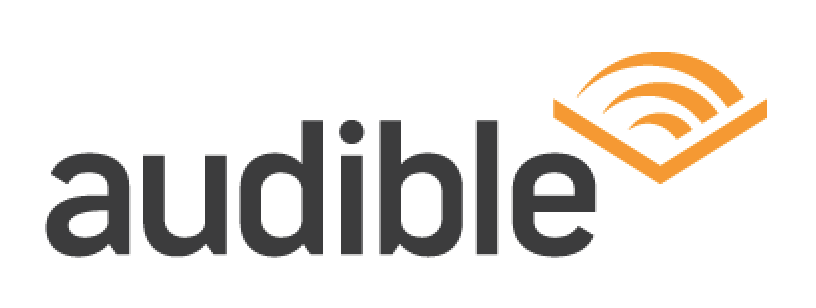

Audiobooks have been available to the public since the 1970s when libraries started stocking cassette tapes of popular books but it wasn't until the 1990s that audio really took off as it became more portable.

Audiobook giant, Audible, was founded in 1995 by Don Katz. It is now the world's most popular audiobook and podcast platform and was bought by Amazon in 2008.

Audible strays away from traditional book fonts such as Baskerville and instead uses a custom typeface called Audible Sans. As this font is non-serif it is more reminiscent of a digital platform than a print one which is what Audible offers. The rounded shape of the individual letters also adds to the more modern look.

To relate it back to reading, Audible's logo is of an open book with what appears to be pages but could signify the swiping motion of a person's finger on their listening device.

The colour of the Audible brand is a pumpkin-orange colour which is the same shade that Amazon uses. By using the same colour, Audible is instantly recognisable as an Amazon-owned brand and promotes a potential customer's sense of trust in relation to them.

Scribd is Audible's greatest competitor. It was founded in 2007 and has grown in popularity advertising that whatever books Audible doesn't offer they generally do instead and vice versa. 

Scribd uses a more widely available typeface called Carmen Sans in the Regular style. This font is very easy to read as it is entirely capitalised and the tracking between the letters in generous. However, it also doesn't have a lot of unique, recognisable brand style.

Scribd's logo pictures two earphones creating an 'S' shape. The logo is often seen alone so it is important that it is something special.  Therefore, it is not necessary that their choice of typography is particularly striking. Interestingly, however, Scribd's logo 'does not meet the threshold of originality needed for copyright protection' as it is only made up of 'simple geometric shapes or text'.

The brand's colours are two different shades of blue. The text is in a shade (#002139) so deep that it is nearly black. The logo is in a deep turquoise colour (#1e7b85). 

Blue has been proven to be a very relaxing and welcoming colour which perhaps hints at easy listening of audiobooks for future customers.