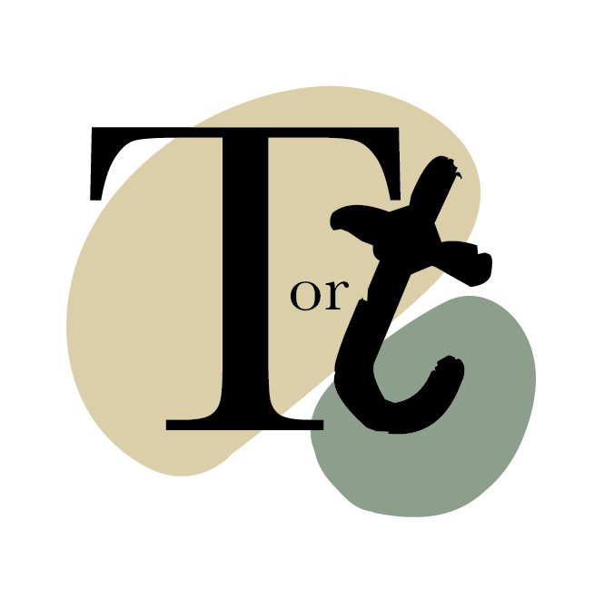
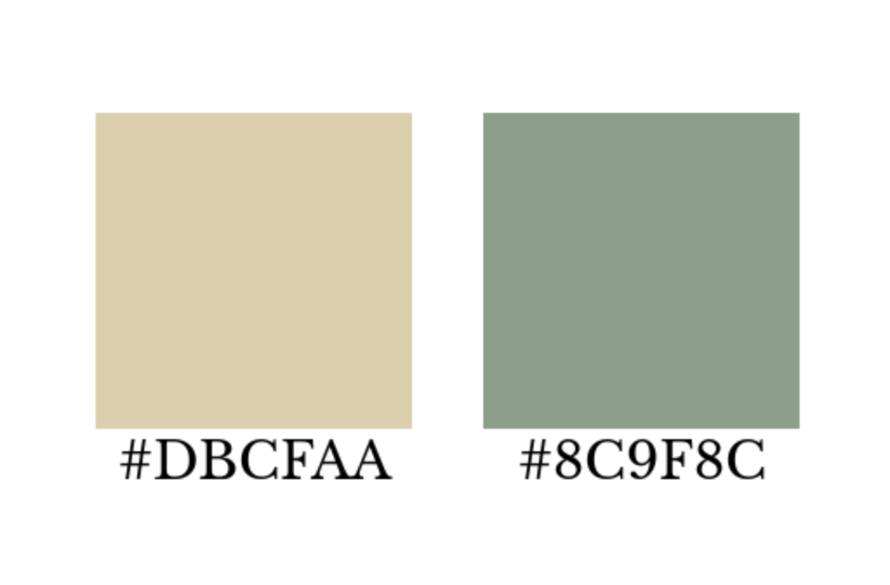
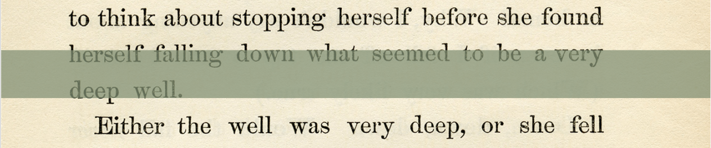

Hello! My name is Jemima and welcome to ***Type or Typo?***

I am a second-year Media, Journalism and Publishing student at Oxford Brookes University. This blog site is the main project for my module on Typographic Design for Page and Screen. It has allowed me to unite my appreciation for visual creation with my passion for writing. I am also a self-confessed Bibliophile and therefore adore anything and everything book related! In this blog, I am able to combine all these things to create an internet space where I discuss, compare, and contrast typography within the book industry. 

A typical blog post will see me discussing some iconic typography used on a book cover, publishing advertisement or even a bookstore front and letting you know whether it really is type or a typo! 

I hope to radiate my love for books across my site in order that I might attract another fellow book lover or, even better still, help convince someone reading this blog to discover their own love for books. In order to do this, I have created a logo that displays the diversity of the content I hope to display on this blog. I have attempted to reflect that, within my logo, with the use of a more traditional serif font commonly seen in novels (*Baskerville*) next to a typewriter-like font (*Old Typewriter*). Combined with this, the 't' for '**Typo**' is slightly off-axis to mimic the idea that it is really a typo. The neutral tones displayed behind these letterforms are reminiscent of the colour of book pages and, what I wish to be, the honesty I hope to exhibit in my blog posts. Again, the typo aspect is emphasised here as the blob-like shapes are imperfect and unique from one another. 

For my header image, I represented the colours featured in my logo through the use of a beige-coloured page of *Alice's Adventures in Wonderland* by Lewis Carroll. The olive green shade prevents the title of my blog from blending in with the words on the image of the book page. I chose *Alice's Adventures in Wonderland* because it is a classic book that many people are familiar with, and in using a book page I am able to show anyone who clicks on my site that this is a blog about books!

Because this blog is centred around typography within books (and just because I love books!) I chose to display my headings in *Libre Baskerville* as it is the most popular font used for the text within books. Similarly, I have chosen to use *Alegreya* for the body text for the same reason and also because they are both fonts that are easy to read for anyone who might view my posts.

![Libre Baskerville and Alegreya family [1001 fonts]](../uploads/screenshot-2020-10-11-at-15.39.14.png "Libre Baskerville and Alegreya family [1001 fonts]")

I hope that my traditional but fun design choices within my blog reflect the book industry that, although many years old, is evolving constantly with the changing times. Thank you for joining me here and taking the time to read my words now and in future posts!

\[Header Background Image: Old Design Shop]